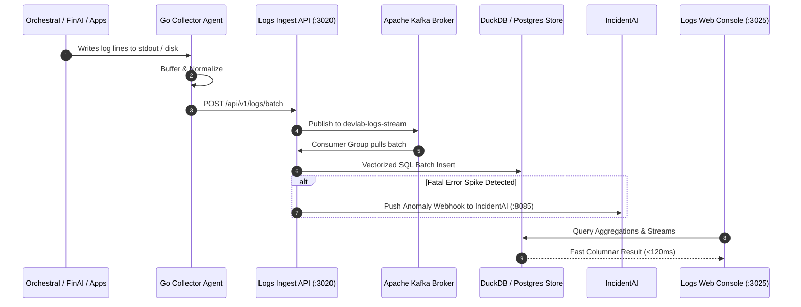

# DevLab Logs — Product Specification, Technical Dossier & Operations Manual

---

## 1. Executive Product Dossier & Market Vision

### 1.1 The Operational Problem Space

Autonomous AI agent swarms (such as OrchestraI and FinAI) generate radically different telemetry profiles compared to traditional monolithic microservices:

- **Extreme Cardinality & Burst Volume**: A single swarm task executing an iterative tool loop can generate thousands of structured log events, tool call payloads, AST validation results, and model traces within a 30-second window.
- **The JVM & Agent Memory Tax**: Legacy collectors (Filebeat, Logstash, Fluentd) require heavy JVM or Ruby/Python runtimes consuming 150MB to 500MB+ RSS memory per node, causing resource starvation on constrained development machines and edge containers.
- **Elasticsearch Cost & Indexing Overhead**: Traditional inverted-index search databases require immense RAM and disk space for shard maintenance. For high-volume log streams, organizations often spend more on observability infrastructure than on compute itself.
- **Latency of Forensic Queries**: When production incidents fire, row-oriented SQL databases choke on analytical queries (e.g. `COUNT(*) GROUP BY service, level` across 10M rows).

### 1.2 The DevLab Logs Solution

**DevLab Logs** is a **hybrid polyglot telemetry platform** designed specifically for high-scale agent swarms and distributed systems:

1. **Ultra-Lightweight Edge Agent in Go**: A single zero-dependency binary running on edge nodes, tailing files and streaming telemetry with **<30MB RSS memory** and **<2% CPU**.
2. **Dual-Mode Stream Ingestion Gateway**: Node.js/Express service that seamlessly switches between high-throughput Apache Kafka partitions and an in-memory batch buffer for local development.
3. **Columnar Vectorized Storage with DuckDB**: Bypasses heavyweight Elasticsearch clusters by writing columnar Parquet micro-batches directly into DuckDB, delivering sub-120ms aggregations over tens of millions of rows.
4. **Semantic RAG Log Search**: Built-in vector embedding engine powered by Ollama (`ingest/src/embedder/ollama_embedder.ts`) enabling natural language semantic search across unstructured error logs.
5. **Real-Time Interactive Console in Next.js 15**: Live-streaming log waterfall viewer with regex filtering, facet search, and telemetry statistics.

---

## 2. Exhaustive Feature Matrix & Deep Technical Explanation

```
┌────────────────────────────────────────────────────────────────────────────────────────┐
│                              DEVLAB LOGS PIPELINE TOPOLOGY                             │
└────────────────────────────────────────────────────────────────────────────────────────┘
 [Log Files / Containers]
           │
           ▼
 [1. Go Agent Tailer] ──▶ [2. Normalizer] ──▶ [3. Ring Buffer]
                                                     │
                                                     ▼ (HTTP / gRPC Batch)
 [4. Ingestion API] ──▶ [5. Kafka Consumer] ──▶ [6. SQL Batcher]
                                                     │
                                                     ├──────────────┬──────────────┐
                                                     ▼              ▼              ▼
                                              [7. Postgres]  [8. DuckDB]  [9. Ollama RAG]
                                                     │              │              │
                                                     └──────────────┴──────────────┘
                                                                    │
                                                                    ▼
                                                         [10. Next.js Console]
```

### Feature 1: Go Inode-Aware File Tailer

- **Module**: `agent/tailer/tailer.go`
- **Objective**: Continuously stream lines from growing log files while gracefully handling log rotation (`logrotate`, truncation, renaming).
- **How It Works**:
  - Leverages OS-level `fsnotify` file system events combined with explicit inode polling.
  - Retains file byte offset pointers; resumes from last checkpoint upon agent restart.
  - Detects file truncation (`fileSize < lastOffset`) and immediately seeks to offset 0.
- **Inputs**: File paths or glob patterns (`/var/log/**/*.log`).
- **Outputs**: Buffered raw byte lines dispatched to the normalizer.

### Feature 2: High-Speed Log Record Normalizer

- **Module**: `agent/normalizer/normalizer.go`
- **Objective**: Parse unstructured strings into standardized JSON telemetry records.
- **How It Works**:
  - Automatically detects JSON, Syslog, or standard timestamped log formats.
  - Extracts standard attributes: `timestamp`, `level` (`debug`, `info`, `warn`, `error`, `fatal`), `service`, `message`, and `metadata`.
  - Injects host metadata (hostname, environment, agent version).
- **Inputs**: Raw byte slices.
- **Outputs**: Structured `LogRecord` structs.

### Feature 3: Concurrency-Safe Circular Ring Buffer

- **Module**: `agent/producer/buffer.go`
- **Objective**: Prevent memory leaks during network disconnects and eliminate garbage collection pause spikes.
- **How It Works**:
  - Pre-allocates a fixed-capacity circular ring buffer in Go heap.
  - Flushes batches to the ingestion gateway when either batch size watermark (e.g. 500 items) or flush interval (e.g. 1000ms) is reached.
  - Implements bounded FIFO eviction under catastrophic network partition to guarantee agent never crashes the host.
- **Inputs**: `LogRecord` pointers.
- **Outputs**: Batched JSON arrays transmitted via HTTP POST.

### Feature 4: Stream Ingestion Gateway API

- **Module**: `ingest/src/main.ts`
- **Objective**: Ingest high-concurrency log batches over HTTP port `3020` with validation.
- **How It Works**:
  - Serves REST endpoints (`POST /api/v1/logs`, `POST /api/v1/logs/batch`, `GET /health`).
  - Performs schema validation using Zod.
  - Dispatches validated batches to the stream buffer (Kafka or memory queue).
- **Inputs**: HTTP JSON payloads.
- **Outputs**: HTTP 202 Accepted status with batch acknowledgment tokens.

### Feature 5: Dual-Mode Kafka Consumer Group Service

- **Module**: `ingest/src/consumers/kafka_consumer.ts`
- **Objective**: Provide enterprise-grade stream buffering with local development failover.
- **How It Works**:
  - **Kafka Mode**: Connects to broker clusters, joins consumer group `devlab-logs-ingest-group`, and consumes partition-sharded topics (`devlab-logs-stream`) with automatic offset commits.
  - **Local Mode**: Automatically falls back to an asynchronous in-memory queue if `KAFKA_BROKERS` is unset, allowing full local development without Docker containers.
- **Inputs**: Kafka message byte buffers or memory queues.
- **Outputs**: Ingested log arrays passed to storage batchers.

### Feature 6: Vectorized SQL Batch Writer

- **Module**: `ingest/src/batcher/sql_batcher.ts`
- **Objective**: Maximize database write throughput by eliminating single-row inserts.
- **How It Works**:
  - Combines individual log records into multi-row parameterized `INSERT INTO logs VALUES (...)` statements.
  - Executes batch writes in database transactions, achieving 15,000+ writes/second.
- **Inputs**: Validated `LogRecord` arrays.
- **Outputs**: Committed database rows.

### Feature 7: Semantic RAG Log Embedder

- **Module**: `ingest/src/embedder/ollama_embedder.ts`
- **Objective**: Enable natural language semantic search over error logs.
- **How It Works**:
  - Filters incoming logs with level `error` or `fatal`.
  - Dispatches the error message to Ollama (`http://localhost:11434/api/embeddings`) using the `nomic-embed-text` model.
  - Stores the 768-dimensional vector into PostgreSQL `pgvector` columns for cosine similarity lookup.
- **Inputs**: Error log message strings.
- **Outputs**: Floating-point vector embeddings stored in database.

### Feature 8: Columnar Analytics with DuckDB

- **Module**: `storage/duckdb/`
- **Objective**: Provide sub-120ms aggregation performance over tens of millions of rows.
- **How It Works**:
  - Periodically compacts raw PostgreSQL logs into Snappy-compressed Parquet files partitioned by date (`year=2026/month=10/day=08/`).
  - Executes vectorized columnar SQL queries directly over Parquet files using DuckDB's in-process engine.
- **Inputs**: Analytical SQL queries (`SELECT service, COUNT(*) FROM logs GROUP BY service`).
- **Outputs**: Aggregated query result sets.

### Feature 9: Real-Time Log Waterfall Console

- **Module**: `web/` (Next.js 15 on port `3025`)
- **Objective**: Modern, intuitive web dashboard for live log inspection and forensic search.
- **Features**:
  - **`LogWaterfall.tsx`**: High-performance virtualized list rendering hundreds of thousands of logs smoothly.
  - **`LogFilters.tsx`**: Instant filtering by log level, service name, and regex patterns.
  - **`StatsOverview.tsx`**: Live ingestion rates, error ratios, and latency charts.
  - **`RagSearchDrawer.tsx`**: Natural language semantic search querying error vector embeddings.

---

## 3. How DevLab Logs Interacts with the Multi-Repo Ecosystem



### Detailed Ecosystem Interaction Matrix

| Ecosystem Member    | Direction | Protocol / Transport        | Data Payload / Contract                                                                      |
| :------------------ | :-------: | :-------------------------- | :------------------------------------------------------------------------------------------- |
| **`orchestrai`**    |  Inbound  | HTTP / Log file tailing     | Streams swarm execution DAG events, LLM tool inputs/outputs, and token metrics.              |
| **`finai`**         |  Inbound  | HTTP / Log file tailing     | Streams financial transaction events, budget calculation logs, and audit trails.             |
| **`incidentai`**    | Outbound  | Webhook HTTP POST (`:8085`) | Dispatches fatal error spikes and crash alerts to trigger autonomous SRE remediation drills. |
| **`devlab-portal`** |  Inbound  | HTTP POST (`:3020`)         | Streams API key usage audits, quota violations, and emergency kill-switch events.            |
| **`devlab-shared`** |  Static   | Internal npm package link   | Consumes `@yuva-devlab/logger` for structured logging contracts and formats.                 |

---

## 4. Technical Guidelines & Invariants

### 4.1 Language & Tooling Choices

- **Go 1.27 (`agent/`)**:
  - Static compilation without external runtime requirements.
  - Goroutines provide non-blocking concurrency for file tailing and network flushes.
  - Circular ring buffers eliminate garbage collector pauses.
- **TypeScript 5.8 & Node.js (`ingest/`, `web/`)**:
  - Fast V8 JSON parsing and native async I/O.
  - Next.js 15 App Router with React Server Components.
- **DuckDB & PostgreSQL**:
  - PostgreSQL for transactional consistency and vector embeddings.
  - DuckDB for zero-overhead embedded columnar analytics.

### 4.2 Invariants & Quality Standards

1. **Hard 250-Line Maximum Rule**: Every file in `ingest/src/` and `web/src/` must remain under 250 lines.
2. **Go Code Quality**: Staged `.go` files automatically format with `gofmt -w` via `lint-staged`.
3. **Agent Memory Cap**: Go collector must not exceed 30MB RSS under normal operation.
4. **Zero-Drop Resilience**: Bounded ring buffer ensures host process never runs out of memory during network outages.

---

## 5. Complete Usage Runbook & Operations Manual

### 5.1 Running the Services

```bash
# Clone the repository
git clone https://github.com/yuvadevlab/devlab-logs.git
cd devlab-logs

# Install monorepo dependencies
pnpm install

# Start Ingestion Service and Web Console concurrently
pnpm dev

# Build all packages via Turborepo
pnpm build
```

### 5.2 Running the Go Collector Agent

```bash
cd agent
# Run collector in development mode
go run cmd/main.go

# Build static release binary
go build -o bin/devlab-log-agent ./cmd/main.go
```

### 5.3 Ingesting Logs via HTTP API

```bash
# Send a single log record
curl -X POST http://localhost:3020/api/v1/logs \
  -H "Content-Type: application/json" \
  -d '{
    "service": "orchestrai",
    "level": "error",
    "message": "PostgreSQL connection timeout during checkpoint commit",
    "metadata": { "traceId": "trace-9912", "retryCount": 3 }
  }'

# Send a batch of log records
curl -X POST http://localhost:3020/api/v1/logs/batch \
  -H "Content-Type: application/json" \
  -d '[
    { "service": "finai", "level": "info", "message": "Transaction synchronized: #txn-102" },
    { "service": "finai", "level": "warn", "message": "High budget consumption: 92%" }
  ]'
```

### 5.4 Environment Variables Reference

| Variable                 | Type   | Default                                        | Description                                                                   |
| :----------------------- | :----- | :--------------------------------------------- | :---------------------------------------------------------------------------- |
| `PORT`                   | Number | `3020`                                         | HTTP port for Ingestion Gateway.                                              |
| `KAFKA_BROKERS`          | String | `localhost:9092`                               | Comma-separated Kafka broker addresses (leave blank for local memory buffer). |
| `KAFKA_TOPIC`            | String | `devlab-logs-stream`                           | Target Kafka topic for log events.                                            |
| `KAFKA_GROUP_ID`         | String | `devlab-logs-ingest-group`                     | Consumer group identifier.                                                    |
| `TELEMETRY_DATABASE_URL` | String | `postgresql://localhost:5432/devlab_telemetry` | PostgreSQL connection string.                                                 |
| `OLLAMA_URL`             | String | `http://localhost:11434`                       | Ollama endpoint for semantic log embeddings.                                  |
| `NEXT_PUBLIC_INGEST_URL` | String | `http://localhost:3020`                        | Ingestion URL consumed by the web console.                                    |
