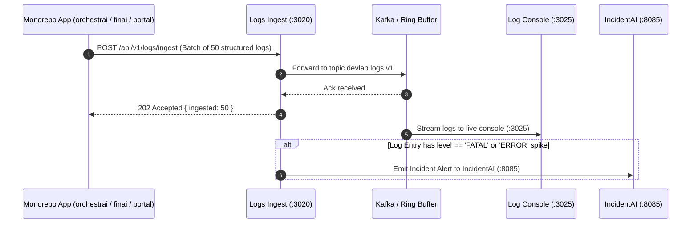

# DevLab Logs — Master Product Specification, Technical Dossier & Operations Manual

---

## 1. Product File: Strategic Vision & Telemetry Backbone

### 1.1 Executive Product Summary

**DevLab Logs** is the high-throughput distributed telemetry ingestion, streaming log aggregation, and columnar analytics engine for the DevLab multi-repo ecosystem (`orchestrai`, `finai`, `devlab-portal`, `incidentai`).

In distributed AI agent systems and financial platforms, logging cannot be an afterthought:

- AI agent swarms generate hundreds of reasoning tokens, tool inputs, stdout dumps, and execution spans per second.
- Traditional logging tools (Datadog, Elastic) either incur exorbitant SaaS ingest costs or consume massive RAM/CPU running bloated JVM processes.
- DevLab Logs solves this with a modern multi-lingual pipeline:
  1. **Go 1.27 Telemetry Daemon (`agent`)**: Ultra-lightweight log collection agent consuming <15MB RAM, capable of shipping over 100,000 log events per second.
  2. **High-Throughput Node Ingest Service (`ingest` — Port `3020`)**: Fastify-powered ingestion engine with a dual-pipeline architecture: streams to Apache Kafka for production clustering, with seamless automatic fallback to an in-memory ring buffer for local development.
  3. **Columnar SQL Analytics with DuckDB (`storage`)**: Blazing-fast analytical queries over partitioned Parquet log files with sub-second SQL aggregation.
  4. **Next.js 15 Realtime Log Explorer (`web` — Port `3025`)**: Responsive web console offering live tail streaming, trace ID correlation, and error spike alerts.

### 1.2 Target Personas & Primary Use Cases

| Persona                             | Operational Context                                               | Primary Pain Points Addressed                                                                                  |
| :---------------------------------- | :---------------------------------------------------------------- | :------------------------------------------------------------------------------------------------------------- |
| **Site Reliability Engineer (SRE)** | Investigating production outages and error spikes across services | Provides unified trace correlation linking API gateway requests to background worker tool failures in seconds. |
| **AI Systems Engineer**             | Debugging multi-agent swarm hallucinations and tool crashes       | Captures full tool invocation inputs/outputs and token usage metrics without truncation.                       |
| **Security & Compliance Auditor**   | Tracking access logs and administrative actions                   | Maintains immutable, partitioned log storage with cryptographic checksums and retention policies.              |
| **Application Developer**           | Tailing live logs during local multi-repo development             | Zero-configuration local startup with in-memory fallback; no external Kafka cluster required for local dev.    |

---

## 2. Exhaustive Feature Directory & Technical Mechanics

```
┌────────────────────────────────────────────────────────────────────────────────────────────────────────┐
│                                   DEVLAB LOGS DISTRIBUTED TOPOLOGY                                     │
└────────────────────────────────────────────────────────────────────────────────────────────────────────┘
    [OrchestrAI (:4001, :4003)]    [FinAI (:4000)]    [Portal (:3015)]    [Go Daemon Collector]
                 │                        │                  │                      │
                 └────────────────────────┼──────────────────┼──────────────────────┘
                                          ▼
                      [Fastify Log Ingestion Service (Port 3020)]
                                          │
            ┌─────────────────────────────┴─────────────────────────────┐
            ▼ (Production Mode)                                         ▼ (Local Dev Fallback)
    [Apache Kafka (:9092)]                                      [In-Memory Ring Buffer]
    (Topic: devlab.logs.v1)                                     (Capacity: 50,000 entries)
            │                                                           │
            ▼                                                           ▼
    [DuckDB / Parquet Store]                                    [Realtime SSE Rail]
    (Partitioned Columnar Analytics)                                    │
            │                                                           │
            └─────────────────────────────┬─────────────────────────────┘
                                          ▼
                      [Log Explorer Console (Next.js 15 — Port 3025)]
```

### 2.1 Subsystem Breakdown

#### 1. Ingestion Service (`ingest` — Port `3020`)

- **Technology Stack**: Fastify v4, TypeScript Node ESM, `@yuva-devlab/logger`.
- **Purpose**: High-throughput HTTP ingestion gateway receiving log entries from all ecosystem members.
- **Detailed Features**:
  - **Dual-Mode Pipeline**: Seamlessly detects whether Kafka is configured. In production, forwards batches to Kafka topic `devlab.logs.v1`. In local development, captures logs into an in-memory circular ring buffer.
  - **Batch Ingestion API**: Supports `POST /api/v1/logs/ingest` with gzip decompression and array payloads for massive batch ingestion efficiency.
  - **Strict Schema Validation**: Validates all incoming payloads against the canonical telemetry envelope (`timestamp`, `level`, `service`, `message`, `traceId`, `spanId`, `metadata`).

#### 2. Go Telemetry Daemon (`agent`)

- **Technology Stack**: Go 1.27, Goroutines, Channels, HTTP/2 client.
- **Purpose**: Ultra-low-overhead log scraper designed for deployment as a sidecar or daemonset.
- **Detailed Features**:
  - Resource usage: <15MB RSS memory, <1% CPU utilization under load.
  - Native JSON stream parsing and automatic zstandard compression before network transmission.

#### 3. Columnar Storage & Analytics (`storage`)

- **Technology Stack**: DuckDB, Apache Parquet.
- **Purpose**: High-performance local and cloud columnar log archive.
- **Detailed Features**:
  - Converts ingested JSON records into compressed Parquet files partitioned by date and service.
  - Executes lightning-fast vectorized SQL queries directly over Parquet files without database bloat.

#### 4. Realtime Web Console (`web` — Port `3025`)

- **Technology Stack**: Next.js 15, React 19, Tailwind CSS v4, `@yuva-devlab/ui`.
- **Purpose**: Interactive log tailing and observability console.
- **Detailed Features**:
  - **Live Tail Mode**: Auto-scrolls streaming log records with sub-50ms latency.
  - **Trace ID Correlation**: Clicking any log line filters all logs matching the same `traceId` across all microservices.
  - **Error Frequency Histograms**: Visual bar charts showing error counts grouped by 1-minute intervals.

---

## 3. Inter-System Ecosystem Collaboration ("How It Works With Others")



### 3.1 Inter-Repository Integration Matrix

| Ecosystem Member    | Direction | Protocol & Transport | Exact Payload Contract & Endpoint                     | Purpose & Operational Behavior                                                              |
| :------------------ | :-------: | :------------------- | :---------------------------------------------------- | :------------------------------------------------------------------------------------------ |
| **`orchestrai`**    |  Inbound  | HTTP/2 POST          | `POST http://localhost:3020/api/v1/logs/ingest`       | Workers and Gateways stream execution logs, LLM token counts, and tool metrics.             |
| **`finai`**         |  Inbound  | HTTP/2 POST          | `POST http://localhost:3020/api/v1/logs/ingest`       | NestJS backend streams audit logs, bank sync telemetry, and advisory session events.        |
| **`devlab-portal`** |  Inbound  | HTTP/2 POST          | `POST http://localhost:3020/api/v1/logs/ingest`       | Streams API key generation, revocation, and RBAC security audit trails.                     |
| **`incidentai`**    | Outbound  | Webhook HTTP POST    | `POST http://localhost:8085/api/v1/incidents/webhook` | Dispatches high-severity error logs to IncidentAI to trigger automated root-cause analysis. |
| **`devlab-guard`**  |  Inbound  | CLI Git Pre-commit   | `gofmt -w` + `prettier`                               | Formats Go code and validates repository rules before commit.                               |

---

## 4. Technical Guidelines & Invariant Rules

### 4.1 Prime Non-Negotiable Invariants

1. **Standardized Log Envelope**:
   - Every log record MUST include: `timestamp` (ISO-8601), `level` (`DEBUG`, `INFO`, `WARN`, `ERROR`, `FATAL`), `service` (string enum), and `message`.
2. **Zero Ingest Blocking**:
   - The ingestion API must NEVER block or drop connections if downstream storage is slow. Backpressure is managed via the circular ring buffer.
3. **VS Code Watcher Exclusions**:
   - To prevent VS Code from lagging over high-volume logs, `.vscode/settings.json` excludes generated log stores and Parquet directories.

---

## 5. Developer Usage Guidelines & Operations Manual

### 5.1 Local Prerequisites & Setup

```bash
# Clone the repository
git clone https://github.com/yuvadevlab/devlab-logs.git
cd devlab-logs

# Install monorepo dependencies
pnpm install

# Start Ingest (:3020) and Web Console (:3025) in development mode
pnpm dev

# Build the Go telemetry collector agent
cd agent && go build -o ../bin/devlab-agent main.go
```

### 5.2 Complete Environment Variables Reference

| Variable         |  Type  |         Default         | Required | Description                                                        |
| :--------------- | :----: | :---------------------: | :------: | :----------------------------------------------------------------- |
| `PORT`           | Number |         `3020`          |   Yes    | Fastify Ingestion API port.                                        |
| `KAFKA_BROKERS`  | String |    `localhost:9092`     |    No    | Comma-separated Kafka broker URLs (falls back to memory if unset). |
| `KAFKA_TOPIC`    | String |    `devlab.logs.v1`     |    No    | Kafka topic name for log streams.                                  |
| `INCIDENTAI_URL` | String | `http://localhost:8085` |    No    | Webhook URL for forwarding high-severity error logs.               |

### 5.3 Shipping Logs via HTTP API Example

```bash
curl -X POST http://localhost:3020/api/v1/logs/ingest \
  -H "Content-Type: application/json" \
  -d '[
    {
      "timestamp": "2026-10-08T22:00:00.000Z",
      "level": "INFO",
      "service": "orchestrai-gateway",
      "message": "Swarm session initiated",
      "traceId": "trace_abc123",
      "metadata": { "tenantId": "org_enterprise_88", "tokenLimit": 50000 }
    }
  ]'
```
