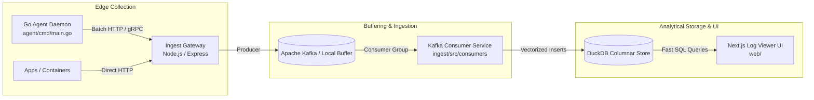

# DevLab Logs — Enterprise Distributed Telemetry & High-Throughput Log Analytics

<p align="center">
  
  
  
  
  
  
</p>

**DevLab Logs** is a hybrid high-throughput log collection, stream ingestion, and columnar analytics platform designed specifically for distributed AI agent swarms and microservices. It unifies edge telemetry collection, event buffering, and analytical querying into an integrated monorepo.

---

## ⚡ Architecture & Pipeline



---

## 🌟 Key Features

1. **Lightweight Go Collector Agent (`agent/`)**:
   - Compiles to a single zero-dependency static binary.
   - Circular ring buffer memory management prevents GC pauses.
   - Inode-aware file tailing and automatic log rotation handling.
2. **Dual-Mode Resilient Ingest Engine (`ingest/`)**:
   - Production mode: Kafka distributed consumer group with automatic rebalancing and partition offset management.
   - Development mode: Zero-config in-memory batch buffer for local offline testing.
3. **Embedded Vectorized Analytics (`storage/`)**:
   - Powered by DuckDB columnar engine for sub-100ms SQL aggregation over millions of rows.
   - Native export to partitioned Parquet files.
4. **Interactive Real-Time Console (`web/`)**:
   - Next.js 15 dashboard with live tailing, regex filtering, error level faceting, and trace timeline visualization.

---

## 🚀 Quick Start

### 1. Run the Entire Monorepo

```bash
# Install dependencies
pnpm install

# Start Ingestion Service and Web Console simultaneously
pnpm dev
```

### 2. Run the Go Edge Agent

```bash
cd agent
go run cmd/main.go --config config.yaml
```

### 3. Build & Typecheck

```bash
# Typecheck TypeScript packages
pnpm typecheck

# Build all packages via Turborepo
pnpm build
```

---

## 📁 Repository Structure

```
devlab-logs/
├── agent/                      # High-performance Go edge telemetry collection daemon
│   ├── cmd/main.go             # Agent CLI entrypoint
│   └── producer/buffer.go      # Concurrent circular ring buffer
├── ingest/                     # Node.js / Express high-throughput stream ingestion service
│   └── src/
│       ├── consumers/          # Dual-mode Kafka consumer group & fallback
│       └── routes/             # Ingestion endpoints & batch handlers
├── storage/                    # DuckDB columnar analytical database adapters
├── web/                        # Next.js 15 interactive log viewer and search console
├── .agents/                    # Specialized AI agent definitions
├── .husky/                     # Pre-commit & commit-msg hooks (gofmt, prettier, commitlint)
├── .vscode/                    # VS Code settings with watcher exclusions & Go format-on-save
├── commitlint.config.ts        # Conventional commits configuration
└── turbo.json                  # Turborepo task pipeline configuration
```
